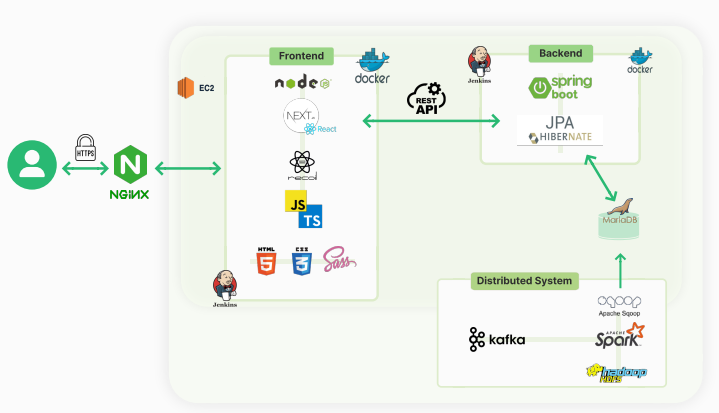
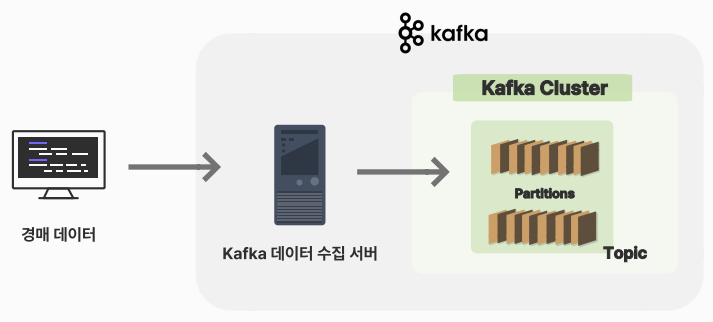
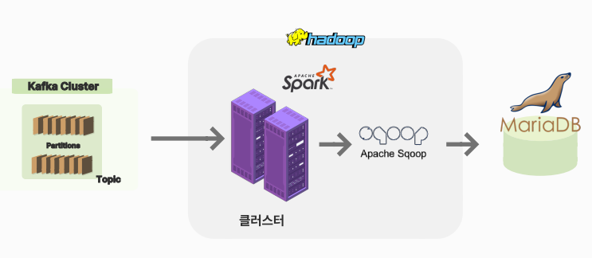
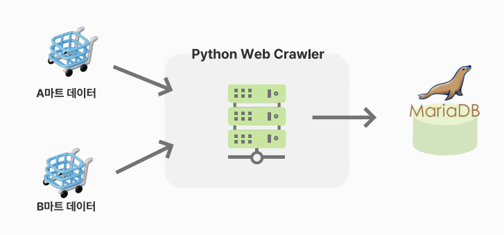
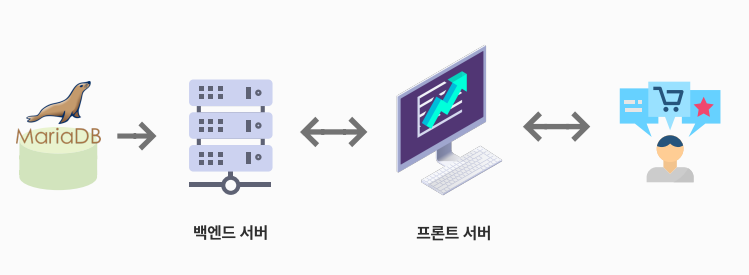
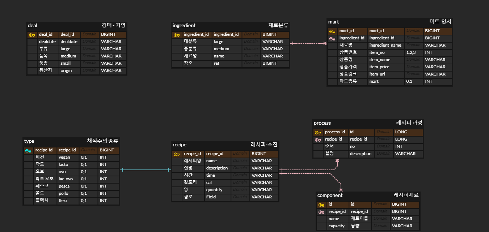
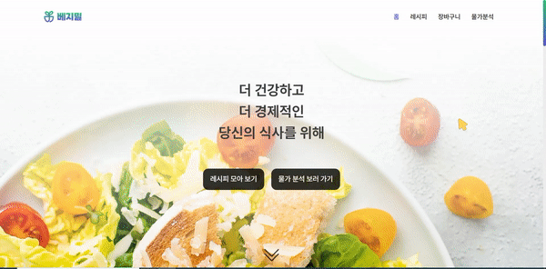
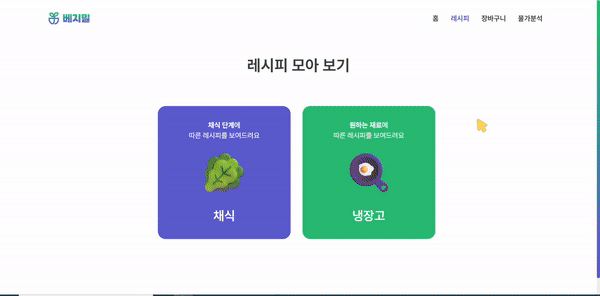
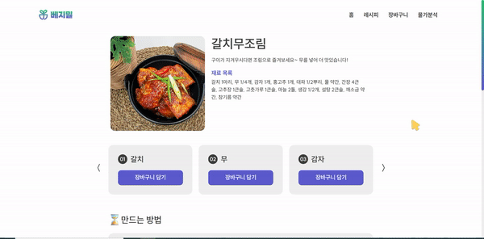
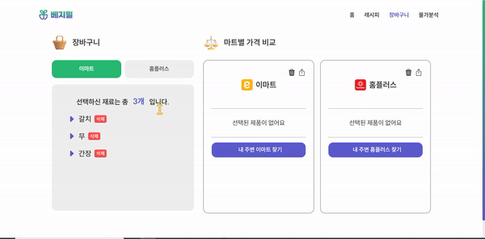

# 빅데이터 분산 프로젝트 - VeggieMeal
---
##### 📑 목차

- [1. 소개](#1-소개)
- [2. 주요 기능](#2-주요-기능)
- [3. 시스템 구조도](#3-시스템-구조도)
- [4. 기술스택](#4-기술스택)
- [5. ERD 다이어그램](#5-erd-다이어그램)
- [6. 기능 상세](#6-기능-상세)
- [7. 개발자](#7-개발자)
- [8. 참고 자료](#8-참고-자료)

---
 

### 1.소개
**VeggieMeal**은 '채식주의자'란 'Veggie'와 '식사'라는 뜻의 'Meal'이 합쳐진 용어입니다.
본 서비스는 채식에 대한 접근성을 높이고 관련 재료의 물가 정보를 제공합니다.
사용자는 채식주의의 타입을 선택하거나 냉장고에 보유 중인 재료를 선택하여 맞춤 레시피를 찾을 수 있습니다. 레시피를 상세 클릭하여 구매하고자는 품목을 장바구니에 담을 수 있습니다.
장바구니에서 현재 마트에서 판매 중인 품목 관련 상품 정보를 확인한 뒤 비교하여 선택할 수 있습니다. **VeggieMeal**은 전국 도매시장 농수산품의 경매 데이터를 일별로 수집하여 평균가 및 최고가, 최저가를 분석합니다.
사용자는 분석 결과를 그래프와 표의 형태로 확인할 수 있습니다.
더 건강하고 더 경제적인 식사, 베지밀이 지향하는 가치입니다.

---
 

### 2. 주요 기능
> _VeggieMeal에서 제공하는 주요 기능입니다. 자세한 내용은 [6. 기능상세](#6-기능-상세) 에서 확인하실 수 있습니다._
#### 1) 레시피 모아보기
- 채식 단계나 재료를 선택하여 레시피를 탐색할 수 있습니다.

##### 2) 장바구니 기능
- 레시피에서 선택한 재료를 담아 마트 별 가격을 비교할 수 있습니다.

##### 3) 물가분석
- 전국 도매시장의 농수산품 경매가 데이터를 실시간으로 수집하고 분석하여 평균가 및 최고가, 최저가를 분석합니다.
- 분석된 정보는 그래프와 표로 간편히 확인할 수 있습니다.

---
 

### 3. 시스템 구조도
##### 1) 아키텍처

##### 2) 데이터 처리 개괄도
* **도매시장 경매가 데이터 실시간 수집 Flow**

---
* **품목별 마트 가격 데이터 수집 Flow**

---
* **데이터 제공 Flow**

---
 

### 4. 기술스택

|      Part      |                            Tech ⚙                            |
| :------------: | :----------------------------------------------------------: |
|   **Front**    |  |
|    **Back**    |  |
| **Deployment** |  |

<strong> 사용 IDE 및 OS 
</strong>

- OS: Ubuntu 22.04.1 LTS 
- IntelliJ IDEA 2022.1.3
- Visual Studio Code : 1.70.2v
- UI/UX: Figma
- Jupyter Notebook

<strong> 백엔드 기술스택 
</strong>

- Openjdk : 1.8.0
- Springboot :  2.7.3
- spring: gradle 
- MariaDB : mariadb 10.3.34
- AWS : ubuntu 20.04.4 LTS 
- Jenkins : 2.361.1
- Docker : 20.10.18
- nginx :  nginx/1.18.0 (Ubuntu)
- Hadoop : 3.2.1
- Spark : 3.2.1
- Sqoop : 1.4.7
- Kafka :  3.2.3
- Python : 3.9.12

<strong> 프론트엔드 기술스택 
</strong>
	
- node.js : v16.15.1(LTS)
- npm : 8.11.0v
- next : 12.3.0v
- react : 18.2.0v
- recoil : 0.7.5v
- TypeScript : 4.8.3v
- Sass : 1.54.9v
- react-query : 3.39.2v

---
 

### 5. ERD 다이어그램

---

### 6. 기능 상세
> _주요 기능만을 설명합니다. 자세한 시나리오가 궁금하시다면 [UCC]()나 [VeggieMeal PPT]()를 참고해주세요!_

##### 1) 메인 페이지
* '레시피 모아보기'나 '물가 분석 보러 가기'를 클릭 시, 해당 페이지로 이동합니다.

##### 2) 레시피
* **채식**
> 채식 단계에 맞는 레시피를 추천합니다.

* **냉장고**
> 선택한 재료에 맞는 레시피를 추천합니다.

* **레시피 상세보기**
> 레시피 별 재료와 만드는 방법, 관련 유튜브 영상을 제공합니다.
> 필요한 품목을 장바구니에 담을 수 있습니다.

##### 5) 장바구니
> 장바구니에 담은 품목의 마트 별 판매 정보를 제공합니다.
> 알맞은 상품을 골라 선택할 수 있고 마트 별 가격을 비교하여 더 저렴한 제품을 구입할 수 있도록 돕습니다.

##### 6) 물가분석
> 실시간으로 제공되는 전국 농수산품 도매 시장의 경매가를 바탕으로 농수산품의 평균가, 최고가, 최저가를 분석합니다.
> 분석 내용을 그래프와 표로 확인하 실 수 있습니다.
> 물가 관련 뉴스를 통해 최신 물가 소식을 제공합니다.

---
 

---
 

### 7. 개발자
##### 1) 프론트엔드
* [김윤주](https://github.com/gimewn): PM (팀장) / UI/UX 디자인 / 상태관리 
* [유이서](https://github.com/yuiseo): UI/UX 디자인 / 물가분석 차트

##### 2) 백엔드
* [박상현](https://github.com/dudtjakdl): 마트 데이터 수집, 가공 / 마트 API
* [이기영](https://github.com/GiYeongLee): 서버 및 API 총괄/ MapReduce
* [정지원](https://github.com/stopone2639): Spark / Sqoop / 배포
* [정호진](https://github.com/junghojin): Kafka / 뉴스 API / 문서화

 

## 8. 참고 자료
* [**Git/Jira Convention**]()
* [**VeggieMeal - 기능명세서**]()
* [**VeggieMeal - 사용자 흐름도**]()
* [**VeggieMeal - 와이어 프레임**]()
* [**VeggieMeal - 포팅 매뉴얼**]()
* [**VeggieMeal - API 문서**]()
* [**VeggieMeal - UCC**]()

---
> _If you have any questions to this project, please contact to c205.jaranda@gmail.com._

